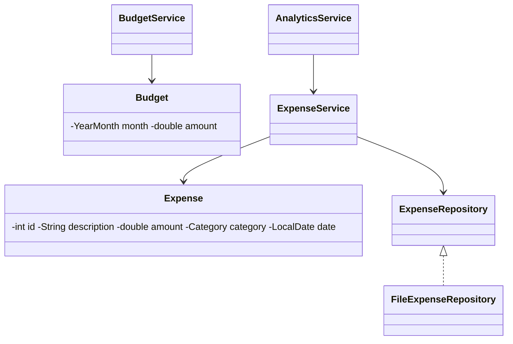

```mermaid
classDiagram
 class Expense { -int id -String description -double amount -Category category -LocalDate date }
 class Budget { -YearMonth month -double amount }
 class ExpenseRepository
 class FileExpenseRepository
 class ExpenseService
 class BudgetService
 class AnalyticsService
 ExpenseRepository <|.. FileExpenseRepository
 ExpenseService --> ExpenseRepository
 ExpenseService --> Expense
 BudgetService --> Budget
 AnalyticsService --> ExpenseService
```
