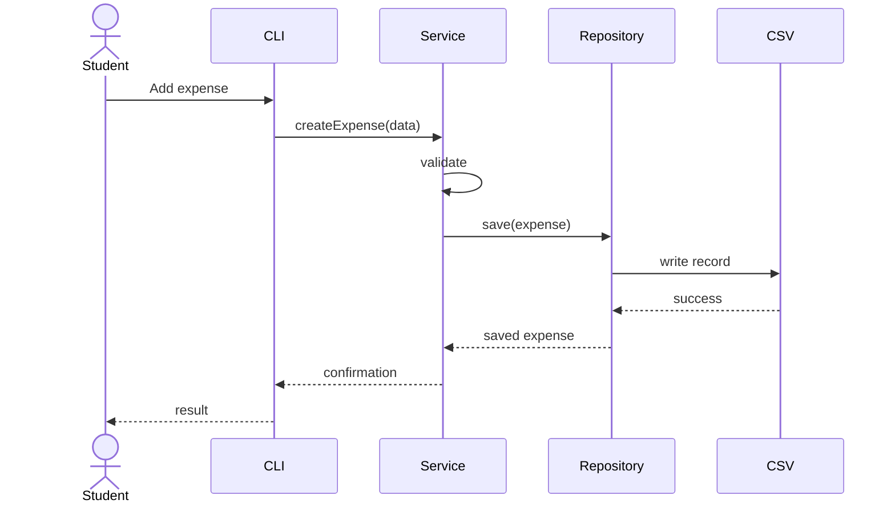

```mermaid
sequenceDiagram
 actor Student
 participant CLI
 participant Service
 participant Repository
 participant CSV
 Student->>CLI: Add expense
 CLI->>Service: createExpense(data)
 Service->>Service: validate
 Service->>Repository: save(expense)
 Repository->>CSV: write record
 CSV-->>Repository: success
 Repository-->>Service: saved expense
 Service-->>CLI: confirmation
 CLI-->>Student: result
```
