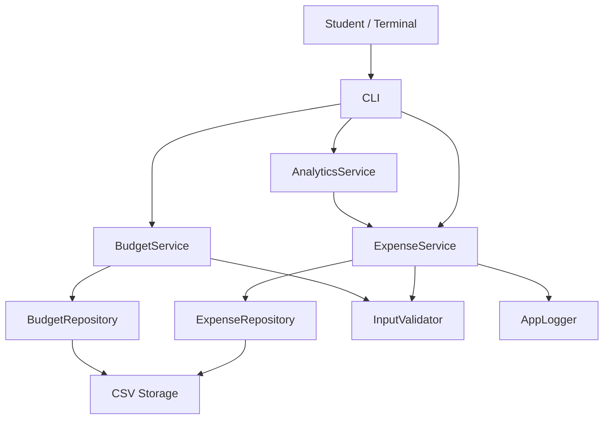

```mermaid
flowchart TD
 U[Student / Terminal] --> UI[CLI]
 UI --> ES[ExpenseService]
 UI --> BS[BudgetService]
 UI --> AS[AnalyticsService]
 ES --> ER[ExpenseRepository]
 ER --> CSV[CSV Storage]
 BS --> BR[BudgetRepository]
 BR --> CSV
 AS --> ES
 ES --> V[InputValidator]
 BS --> V
 ES --> L[AppLogger]
```
