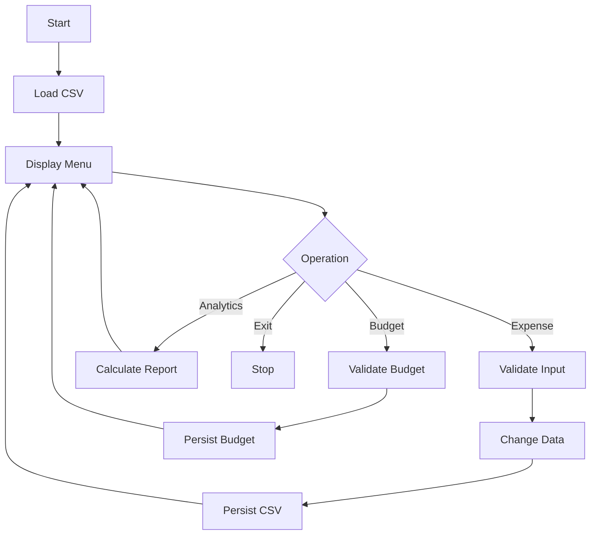

```mermaid
flowchart TD
 A[Start] --> B[Load CSV]
 B --> C[Display Menu]
 C --> D{Operation}
 D -->|Expense| E[Validate Input]
 E --> F[Change Data]
 F --> G[Persist CSV]
 D -->|Budget| H[Validate Budget]
 H --> I[Persist Budget]
 D -->|Analytics| J[Calculate Report]
 G --> C
 I --> C
 J --> C
 D -->|Exit| K[Stop]
```
